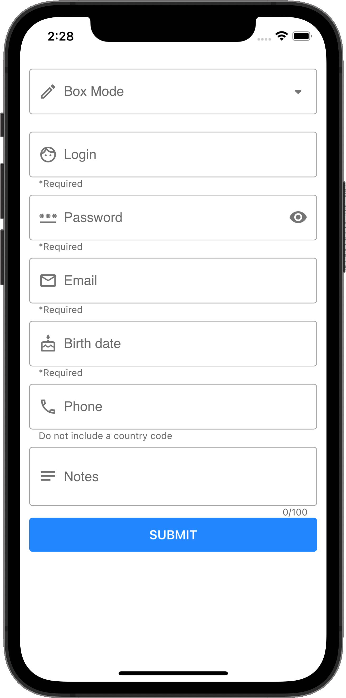
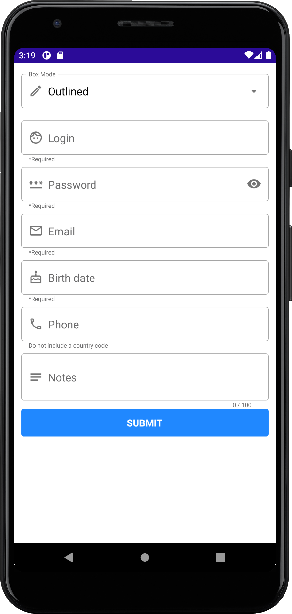

<!-- default badges list -->

[](https://supportcenter.devexpress.com/ticket/details/T1033270)
[](https://docs.devexpress.com/GeneralInformation/403183)
<!-- default badges end -->
# DevExpress Editors for .NET MAUI

This repository contains a demo application that allows you to get started with DevExpress Editors for .NET MAUI.

 

The DevExpress Editors for .NET MAUI library contains the following controls: [TextEdit](http://docs.devexpress.com/MAUI/DevExpress.Maui.Editors.TextEdit), [MultilineEdit](http://docs.devexpress.com/MAUI/DevExpress.Maui.Editors.MultilineEdit), [PasswordEdit](http://docs.devexpress.com/MAUI/DevExpress.Maui.Editors.PasswordEdit), [ComboBoxEdit](http://docs.devexpress.com/MAUI/DevExpress.Maui.Editors.ComboBoxEdit), [AutoCompleteEdit](http://docs.devexpress.com/MAUI/DevExpress.Maui.Editors.AutoCompleteEdit), [NumericEdit](http://docs.devexpress.com/MAUI/DevExpress.Maui.Editors.NumericEdit), [DateEdit](http://docs.devexpress.com/MAUI/DevExpress.Maui.Editors.DateEdit), [TimeEdit](http://docs.devexpress.com/MAUI/DevExpress.Maui.Editors.TimeEdit), [CheckEdit](http://docs.devexpress.com/MAUI/DevExpress.Maui.Editors.CheckEdit), and [SimpleButton](http://docs.devexpress.com/MAUI/DevExpress.Maui.Editors.SimpleButton).

See the following help topic for more information: [DevExpress Editors for .NET MAUI](http://docs.devexpress.com/MAUI/403427/editors/index).

## Prerequisites

1. Install Visual Studio 2022 and the latest .NET MAUI version. See the following topic on docs.microsoft.com for more information: [Installation](https://docs.microsoft.com/en-gb/dotnet/maui/get-started/installation).
1. Register the following NuGet feed in Visual Studio:
    ```
    https://nuget.devexpress.com/free/api
    ```
    > If you are an active [DevExpress Universal](https://www.devexpress.com/subscriptions/universal.xml) customer, DevExpress Controls for .NET MAUI are available in your [personal NuGet feed](https://nuget.devexpress.com/).
    
    See the following topic on docs.microsoft.com for more information on how to register a NuGet source: [Install and manage packages in Visual Studio](https://docs.microsoft.com/en-us/nuget/consume-packages/install-use-packages-visual-studio#package-sources).
