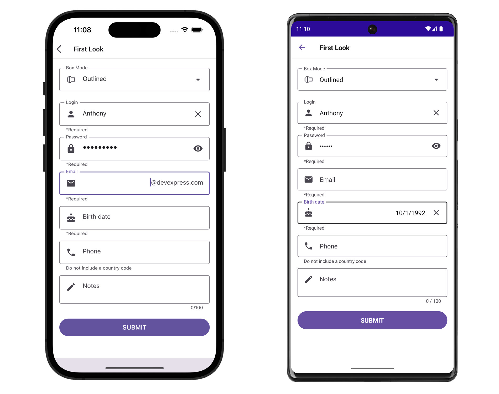

<!-- default badges list -->

<!-- default badges end -->
# DevExpress Editors for .NET MAUI

[DevExpress Mobile UI](https://www.devexpress.com/maui/) allows you to use a .NET cross-platform UI toolkit and C# to build native apps for iOS and Android.

The **DevExpress Mobile UI for Xamarin.Forms and .NET MAUI** is free of charge. To learn more about our offer and to reserve your copy, visit [Free DevExpress Mobile UI for Xamarin.Forms and .NET MAUI](https://www.devexpress.com/xamarin-free).

## Requirements

Please register the DevExpress NuGet Gallery in Visual Studio to restore the NuGet packages used in this solution. See the following topic for more information: [Get Started with DevExpress Mobile UI for .NET MAUI](https://docs.devexpress.com/MAUI/403249/get-started).

You can also refer to the following YouTube video for more information on how to get started with the DevExpress .NET MAUI Controls: [Setting up a .NET MAUI Project](https://www.youtube.com/watch?v=juJvl5UicIQ).

## What's in This Repository

This repository contains a demo application that allows you to get started with DevExpress Editors for .NET MAUI.

The DevExpress Editors for .NET MAUI library contains the following controls: [TextEdit](http://docs.devexpress.com/MAUI/DevExpress.Maui.Editors.TextEdit), [MultilineEdit](http://docs.devexpress.com/MAUI/DevExpress.Maui.Editors.MultilineEdit), [PasswordEdit](http://docs.devexpress.com/MAUI/DevExpress.Maui.Editors.PasswordEdit), [ComboBoxEdit](http://docs.devexpress.com/MAUI/DevExpress.Maui.Editors.ComboBoxEdit), [AutoCompleteEdit](http://docs.devexpress.com/MAUI/DevExpress.Maui.Editors.AutoCompleteEdit), [NumericEdit](http://docs.devexpress.com/MAUI/DevExpress.Maui.Editors.NumericEdit), [DateEdit](http://docs.devexpress.com/MAUI/DevExpress.Maui.Editors.DateEdit), [TimeEdit](http://docs.devexpress.com/MAUI/DevExpress.Maui.Editors.TimeEdit), [CheckEdit](http://docs.devexpress.com/MAUI/DevExpress.Maui.Editors.CheckEdit), and [SimpleButton](http://docs.devexpress.com/MAUI/DevExpress.Maui.Editors.SimpleButton).

See the following help topic for more information: [DevExpress Editors for .NET MAUI](http://docs.devexpress.com/MAUI/403427/editors/index).

You can also refer to the following YouTube video for instruction on how to get started with the Data Editors: [Adding Data Editors to Your .NET MAUI App](https://www.youtube.com/watch?v=Njq2qCB3j6k).

### Files to Review

<!-- default file list -->
* [MauiProgram.cs](./CS/MauiProgram.cs)
* [MainPage.xaml](./CS/MainPage.xaml)
* [MainViewModel.cs](./CS/MainViewModel.cs)
<!-- default file list end -->

## How to Run This Application

1. Install Visual Studio 2022 and the latest .NET MAUI version. See the following topic on docs.microsoft.com for more information: [Installation](https://docs.microsoft.com/en-gb/dotnet/maui/get-started/installation).
1. Register [your personal NuGet feed](https://nuget.devexpress.com/) in Visual Studio:

   > If you are an active [DevExpress Universal](https://www.devexpress.com/subscriptions/universal.xml) customer, DevExpress Controls for .NET MAUI are available in your [personal NuGet feed](https://nuget.devexpress.com/).
    
    See the following topic on docs.microsoft.com for more information on how to register a NuGet source: [Install and manage packages in Visual Studio](https://docs.microsoft.com/en-us/nuget/consume-packages/install-use-packages-visual-studio#package-sources).

## Documentation

- [Data Grid](https://docs.devexpress.com/MAUI/403255/data-grid/data-grid)
- [Charts](https://docs.devexpress.com/MAUI/403300/charts/charts)
- [Data Form](https://docs.devexpress.com/MAUI/403640/data-form)
- [Navigation](https://docs.devexpress.com/MAUI/403297/navigation/index)
- [Data Editors](https://docs.devexpress.com/MAUI/403427/editors/index)
- [Collection View](https://docs.devexpress.com/MAUI/403324/collection-view/index)

## More Examples

* [Stocks App](https://github.com/DevExpress-Examples/maui-stocks-mini)
* [Data Grid](https://github.com/DevExpress-Examples/maui-data-grid-get-started)
* [Data Form](https://github.com/DevExpress-Examples/maui-data-form-get-started)
* [Charts](https://github.com/DevExpress-Examples/maui-charts)
* [Scheduler](https://github.com/DevExpress-Examples/maui-scheduler-get-started)
* [Tab Page](https://github.com/DevExpress-Examples/maui-tab-page-get-started)
* [Tab View](https://github.com/DevExpress-Examples/maui-tab-view-get-started)
* [Drawer Page](https://github.com/DevExpress-Examples/maui-drawer-page-get-started)
* [Drawer View](https://github.com/DevExpress-Examples/maui-drawer-view-get-started)
* [Collection View](https://github.com/DevExpress-Examples/maui-collection-view-get-started)
* [Popup](https://github.com/DevExpress-Examples/maui-popup-get-started)
